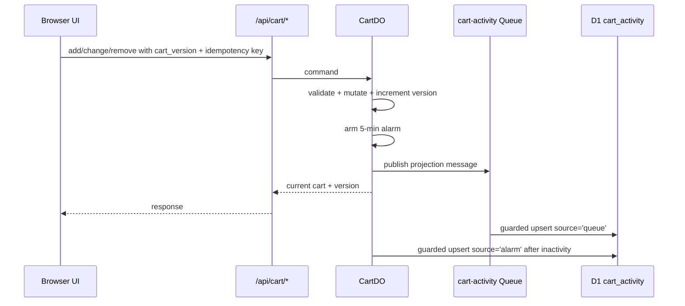

# Zabir Boutiques Master Plan v7

**Fresh Cloudflare-Native, Red-Team-Hardened, AI-Developer-Friendly Build Contract**

**Project:** Zabir Boutiques eCommerce + F-commerce + POS Platform  
**Target market:** Bangladesh boutique retail, Facebook-commerce customers, mobile-first shoppers  
**Primary stack:** Astro 6, React Islands, Tailwind CSS, Cloudflare Workers/Pages, D1, Durable Objects, R2, KV, Queues, Cron, Turnstile, Zero Trust Access  
**Document version:** v7 Canonical Master Plan  
**Date:** 2026-06-23  
**Status:** Source of truth for human developers, AI coding agents, reviewers, and release sign-off  
**Replaces:** V7 Master Plan + V7.1 Re-Review/Audit findings  

---

## 0. How to Use This Document

This file is the **single canonical master plan** for implementation. It merges the old architecture plan and the red-team review into one developer-ready contract.

Recommended repository split after baseline implementation:

```txt
docs/
  MASTER_PLAN.md          # this canonical contract, kept concise
  ARCHITECTURE.md         # expanded Cloudflare architecture details
  SECURITY.md             # WAF, CSP, Access, Turnstile, secrets, privacy
  DATA_MODEL.md           # D1, Drizzle, migrations, retention
  OPERATIONS.md           # CI/CD, observability, incident response, DR
  AI_AGENT.md             # coding-agent rules, prompts, forbidden patterns
```

Until that split is created, this file is authoritative. If any README, AI prompt, ticket, implementation note, or generated code conflicts with this document, this document wins.

### Merge Decision

Use a **single master plan now** because the project needs one clear source of truth. Keep audit reports separate as evidence, not as build instructions. Once the P0 remediation baseline is complete, split this file into smaller operational documents while keeping `MASTER_PLAN.md` as the root contract.

---

## 1. Executive Summary

Zabir Boutiques is a Cloudflare-native commerce platform for Bangladesh boutique and F-commerce operations. It supports product catalogues, mobile-first product pages, cart, Buy Now direct orders, guest checkout, COD, partial prepayment, online payment, staff-assisted orders, POS counter sales, inventory control, fraud review, shipping labels, returns, email notifications, Bangla/English search, and AI-assisted product content.

The engineering priority is not only page speed. The real priority is **transaction integrity**:

1. No overselling.
2. No browser-trusted pricing.
3. No payment state without provider verification.
4. No cart state drift between Durable Objects, D1 projections, and client UI.
5. No staff route exposed without Zero Trust and RBAC.
6. No raw secrets, PII, or payment payloads in logs.
7. No AI-generated public content without staff review.
8. No production release while P0 guardrails fail.

The previous audit found multiple P0 risks. v7 converts those findings into mandatory implementation rules, migrations, tests, and AI-agent instructions.

---

## 2. Non-Negotiable Canonical Decisions

| Area | v7 Decision |
|---|---|
| Framework | Astro 6 with `output: 'server'` and `@astrojs/cloudflare`. Static pages opt in with `export const prerender = true`. Dynamic routes omit `prerender = false`. |
| Rendering | Server-first. Public marketing/catalog pages are selectively prerendered. Checkout, payment, staff, POS, APIs, auth, webhooks, and live inventory are dynamic. |
| Hosting | Cloudflare Pages + Workers/Pages Functions. Worker-first deployment is acceptable if it simplifies bindings and observability. |
| Database | Cloudflare D1 is canonical for relational business data: products, orders, payments, staff, invoices, audit logs, projections, and migrations. |
| Strong consistency | Durable Objects are mandatory for carts, inventory serialization, idempotency, direct checkout sessions, provider health, and AI budget counters. |
| Object storage | R2 stores product images, generated variants, logs, backups, reports, and exported evidence. |
| KV | KV is allowed only for stale-tolerant data such as flags, redirects, prefix cache, revocation hints, and non-authoritative metadata. |
| Cart source of truth | `CartDO` is the only active cart source of truth. D1 `cart_activity` is only a searchable projection. KV and localStorage must not be authoritative. |
| Buy Now | `DirectCheckoutSessionDO` is isolated from `CartDO`. Buy Now never mutates the normal cart. |
| Pricing | Server reloads price, delivery fee, discount, VAT, advance, balance, and stock. Browser totals are ignored. |
| Money | All commerce money is integer paisa. Floating point is forbidden except AI provider cost accounting in USD. |
| Payments | Hosted payment pages only. Redirects are not proof of payment. Webhook + server-side verification + reconciliation are required. |
| Inventory | All online reservations and POS direct sales pass through `VariantInventoryDO`. D1 is not directly mutated for stock authority outside DO-controlled gateways. |
| Security | Zero Trust Access, RBAC, CSRF, Turnstile, WAF, rate limits, CSP, HMAC webhooks, and Cloudflare Secrets are mandatory. |
| AI | Workers AI first. DeepSeek fallback only when budget permits. Staff review required before publishing AI text. |
| Audits | Guardrails, drift checks, migration tests, and P0 test suites block release. |

---

## 3. Target Cloudflare-Native Architecture

```mermaid
flowchart TD
  Customer[Mobile Customer Browser] --> Edge[Cloudflare Edge]
  Edge --> WAF[WAF + Rate Limiting + Bot Controls]
  WAF --> Turnstile[Turnstile Challenge Where Needed]
  Turnstile --> Pages[Astro Pages / Workers]

  Staff[Staff Browser] --> Access[Cloudflare Zero Trust Access]
  Access --> StaffApp[Staff Routes + RBAC]
  StaffApp --> Pages

  Pages --> D1[(Cloudflare D1)]
  Pages --> R2[(R2 Images Logs Backups)]
  Pages --> KV[(KV Flags Redirects Prefix Cache)]
  Pages --> CartDO[CartDO]
  Pages --> BuyDO[DirectCheckoutSessionDO]
  Pages --> InvDO[VariantInventoryDO]
  Pages --> IdemDO[IdempotencyDO]
  Pages --> ProviderDO[ProviderHealthDO]
  Pages --> BudgetDO[BudgetCounterDO]
  Pages --> Queues[Cloudflare Queues]

  Queues --> PaymentConsumer[Payment Event Consumer]
  Queues --> EmailConsumer[Email Consumer]
  Queues --> FraudConsumer[Fraud Audit Consumer]
  Queues --> ImageConsumer[Image Processing Consumer]
  Queues --> CartConsumer[Cart Activity Consumer]
  Queues --> BackupConsumer[D1 Backup Consumer]

  Cron[Cron Triggers] --> Reconcile[Payment Reconciliation]
  Cron --> ReservationCleanup[Reservation Cleanup]
  Cron --> Sitemap[Sitemap Generation]
  Cron --> Backups[D1 Backups]
  Cron --> LowStock[Low Stock Digest]

  Pages --> PaymentProviders[UddoktaPay / SSLCommerz]
  PaymentProviders --> Webhook[/api/payments/webhook]
  Webhook --> Queues
```

### 3.1 Service Ownership Matrix

| Concern | Cloudflare Service | Role |
|---|---|---|
| Static/public pages | Pages/CDN | Prerendered pages and hashed assets |
| Dynamic commerce routes | Workers / Pages Functions | Checkout, APIs, payment, staff, POS |
| Relational data | D1 | Products, orders, payments, staff, invoices, audit logs |
| Strong consistency | Durable Objects | Cart, inventory, idempotency, direct sessions, provider health |
| Blob storage | R2 | Images, variants, logs, backups, reports |
| Stale-tolerant cache | KV | Flags, redirects, prefix autocomplete cache, revocation hints |
| Async jobs | Queues | Webhooks, emails, image processing, cart projection, fraud audit |
| Scheduled jobs | Cron Triggers | Reconciliation, cleanup, backups, sitemap, reports |
| Bot protection | Turnstile + WAF | Checkout, login, coupon, forms |
| Staff perimeter | Zero Trust Access | `/staff/*`, `/api/staff/*` |
| Security edge | WAF, Rate Limiting, Rulesets | Abuse control and route protection |
| Observability | Workers Analytics Engine, logs, R2 archives | Metrics, traces, alerts, audit evidence |

---

## 4. Recommended Repository Structure

```txt
src/
  components/
    primitives/
    product/
    cart/
    checkout/
    staff/
    pos/
  db/
    client.ts
    schema/
      catalog.ts
      cart.ts
      checkout.ts
      orders.ts
      payments.ts
      pos.ts
      staff.ts
      operations.ts
      index.ts
    queries/
      products.ts
      orders.ts
      staff.ts
      search.ts
      cart-activity.ts
    services/
      checkout-service.ts
      order-service.ts
      inventory-read-service.ts
      payment-service.ts
      pos-service.ts
  durable-objects/
    cart-do.ts
    direct-checkout-session-do.ts
    variant-inventory-do.ts
    idempotency-do.ts
    provider-health-do.ts
    budget-counter-do.ts
  lib/
    contracts/
      cart-do.ts
      direct-checkout-session-do.ts
      variant-inventory-do.ts
      idempotency-do.ts
      provider-health-do.ts
      budget-counter-do.ts
      payment-provider.ts
      email-provider.ts
      index.ts
    integrations/
      payments/
        uddoktapay/
        sslcommerz/
      email/
        resend/
        cloudflare-email/
      fraudbd/
      workers-ai/
      deepseek/
      imagify/
      courier/
        pathao/
        steadfast/
        redx/
    security/
      csp.ts
      csrf.ts
      hmac.ts
      rate-limit.ts
      turnstile.ts
      access.ts
      pii-redaction.ts
    i18n/
      index.ts
      bangla-normalize.ts
      search-synonyms.ts
    money/
      paisa.ts
    logger/
      structured-log.ts
  middleware.ts
  pages/
    products/[slug].astro
    categories/[slug].astro
    buy-now/[slug].astro
    checkout.astro
    staff/
    api/
      cart/
      buy-now/
      checkout.ts
      payments/webhook.ts
      staff/
queues/
  consumers/
    payment-webhooks.ts
    order-emails.ts
    fraud-audit.ts
    image-processing.ts
    cart-activity.ts
    d1-backup.ts
migrations/
  0001_initial.sql
  ...
  rollback/
  tests/
scripts/
  audit/
    audit-drift.ts
  migrations/
    apply.ts
    verify.ts
infra/
  cloudflare/
    waf.tf
    rate-limits.tf
    access.tf
    cache.tf
    dns.tf
    tunnel.tf
```

Rules:

- Route handlers must be thin.
- Business logic belongs in services.
- D1 access belongs in `src/db/queries` and `src/db/services`.
- Durable Object methods must implement contracts from `src/lib/contracts`.
- External APIs must be called only through adapters.
- Tests must target contracts, services, DOs, migrations, and replay behavior.

---

## 5. Framework and Routing Contract

### 5.1 Astro Configuration

```js
// astro.config.mjs
import { defineConfig } from 'astro/config';
import react from '@astrojs/react';
import cloudflare from '@astrojs/cloudflare';
import tailwindcss from '@tailwindcss/vite';

export default defineConfig({
  output: 'server',
  adapter: cloudflare(),
  integrations: [react()],
  vite: {
    plugins: [tailwindcss()],
  },
});
```

### 5.2 Static Routes

Static routes must explicitly opt in:

```ts
export const prerender = true;
```

| Route | Reason |
|---|---|
| `/` | Homepage and marketing content |
| `/products/[slug]` | SEO product snapshot; live stock fetched separately |
| `/categories/[slug]` | SEO category snapshot |
| `/collections/[slug]` | Collection page |
| `/blog/[slug]` | Editorial content |
| `/about` | Static info |
| `/privacy` | Legal page |
| `/terms` | Legal page |
| `/return-policy` | Legal page |
| `/size-guide` | Static guide |

### 5.3 Dynamic Routes

Dynamic routes omit `prerender = false`. They are dynamic by default under `output: 'server'`.

| Route | Purpose |
|---|---|
| `/cart` | Cart shell, CartDO data through API |
| `/checkout` | Server-safe checkout state |
| `/buy-now/[slug]` | Direct checkout landing session |
| `/api/cart/*` | CartDO operations |
| `/api/buy-now/session` | Create direct checkout session |
| `/api/buy-now/submit` | Submit direct order through checkout engine |
| `/api/checkout` | Order creation and payment initiation |
| `/api/payments/webhook` | Payment webhook receiver |
| `/api/payments/reconcile` | Cron/internal reconciliation |
| `/api/stock/[variant_id]` | Live stock availability |
| `/api/search` | D1 FTS search |
| `/staff/*` | Staff dashboard |
| `/api/staff/*` | Staff APIs |
| `/staff/sales/pos` | POS counter sales |

Forbidden:

```txt
output: 'static'
output: 'hybrid'
export const prerender = false
```

---

## 6. Data Ownership Contract

| Data | Authoritative Source | Projection / Cache | Notes |
|---|---|---|---|
| Product metadata | D1 | Static snapshots, Cache API | D1 wins |
| Product image objects | R2 | CDN cache | D1 stores R2 keys |
| Product price | D1 | Static display snapshot | Checkout reloads price |
| Inventory | VariantInventoryDO + D1 ledger | Live stock API | DO serializes mutations |
| Active cart | CartDO | React state, D1 `cart_activity` projection | D1 not used for active checkout cart |
| Buy Now session | DirectCheckoutSessionDO | D1 after order creation | Fully isolated from CartDO |
| Orders | D1 | None | D1 canonical |
| Payment events | D1 | Queue replay | Idempotent event table |
| Staff sessions | HttpOnly cookie + D1/KV revocation hints | None | RBAC checked server-side |
| POS invoices | D1 invoice ledger | None | Separate from online orders |
| Audit logs | D1 hot + R2 archive | Analytics Engine | Redacted and append-only |
| AI budget config | D1 `ai_budget_limits` | BudgetCounterDO live counter | DO enforces live counts |
| Provider health | ProviderHealthDO | D1 `api_audit_logs` | Circuit state and audit |

---

## 7. D1 Database Architecture

D1 is the relational source of truth. Every schema change must use numbered SQLite-compatible migrations, rollback files, and invalid-insert tests.

### 7.1 Required Table Groups

```txt
catalog:
  products
  product_variants
  categories
  product_categories
  product_images
  product_tags
  inventory_items
  variants compatibility view

cart_checkout:
  cart_activity
  direct_checkout_activity
  coupons
  coupon_redemptions
  idempotency_keys
  stock_reservations

orders_payments:
  orders
  order_items
  order_status_events
  payment_events
  returns
  return_items
  refunds

pos:
  invoices
  invoice_items
  invoice_payments
  invoice_audit
  daily_invoice_counters

staff_security:
  staff_users
  staff_roles
  staff_permissions
  staff_sessions
  password_reset_tokens
  password_reset_rate_limits
  csrf_nonces
  otp_secrets
  audit_log

operations:
  api_audit_logs
  email_log
  stock_adjustments
  inventory_reconciliation_runs
  ai_generation_log
  ai_budget_limits
  backup_log
```

### 7.2 Money Rules

All commerce money columns must use integer paisa:

```txt
price_paisa
subtotal_paisa
delivery_paisa
discount_paisa
vat_paisa
total_paisa
advance_paisa
balance_paisa
refund_paisa
```

Forbidden for commerce money:

```txt
REAL
FLOAT
DOUBLE
decimal string money values
browser-supplied totals
```

Only AI cost accounting may use float USD inside `BudgetCounterDO.recordUsage()` because provider pricing can use fractional USD units.

### 7.3 Cart Activity Projection Schema

`cart_activity` is not the active cart. It is a D1 projection for abandoned cart, analytics, and staff reporting.

Required columns:

```sql
CREATE TABLE cart_activity (
  session_id TEXT PRIMARY KEY,
  customer_phone TEXT,
  customer_email TEXT,
  customer_name TEXT,
  item_count INTEGER NOT NULL DEFAULT 0,
  total_quantity INTEGER NOT NULL DEFAULT 0,
  subtotal_paisa INTEGER NOT NULL DEFAULT 0,
  last_cart_update_at TEXT NOT NULL,
  checkout_started_at TEXT,
  converted_order_id TEXT,
  abandoned_email_sent_at TEXT,
  consent_status TEXT NOT NULL DEFAULT 'unknown'
    CHECK (consent_status IN ('unknown','allowed','denied')),

  -- v7 monotonic write race contract
  last_d1_write_at TEXT,
  last_d1_write_source TEXT CHECK (
    last_d1_write_source IN ('alarm','queue','lifecycle_cleanup','manual_repair')
  ),
  last_d1_write_seq INTEGER NOT NULL DEFAULT 0,

  updated_at TEXT NOT NULL
);

CREATE INDEX idx_cart_activity_abandoned
  ON cart_activity(last_cart_update_at)
  WHERE converted_order_id IS NULL
    AND abandoned_email_sent_at IS NULL;

CREATE INDEX idx_cart_activity_email
  ON cart_activity(customer_email)
  WHERE customer_email IS NOT NULL;
```

Required guarded upsert pattern:

```sql
INSERT INTO cart_activity (
  session_id,
  customer_phone,
  customer_email,
  customer_name,
  item_count,
  total_quantity,
  subtotal_paisa,
  last_cart_update_at,
  consent_status,
  last_d1_write_at,
  last_d1_write_source,
  last_d1_write_seq,
  updated_at
)
VALUES (
  :session_id,
  :customer_phone,
  :customer_email,
  :customer_name,
  :item_count,
  :total_quantity,
  :subtotal_paisa,
  :last_cart_update_at,
  :consent_status,
  :write_ts,
  :write_source,
  1,
  :write_ts
)
ON CONFLICT(session_id) DO UPDATE SET
  customer_phone = excluded.customer_phone,
  customer_email = excluded.customer_email,
  customer_name = excluded.customer_name,
  item_count = excluded.item_count,
  total_quantity = excluded.total_quantity,
  subtotal_paisa = excluded.subtotal_paisa,
  last_cart_update_at = excluded.last_cart_update_at,
  consent_status = excluded.consent_status,
  last_d1_write_at = excluded.last_d1_write_at,
  last_d1_write_source = excluded.last_d1_write_source,
  last_d1_write_seq = cart_activity.last_d1_write_seq + 1,
  updated_at = excluded.updated_at
WHERE excluded.last_d1_write_at >= COALESCE(cart_activity.last_d1_write_at, '');
```

This prevents delayed queue writes from overwriting fresher alarm writes.

### 7.4 Direct Checkout Activity Schema (P0-11)

`direct_checkout_activity` is a D1 searchable index for direct checkout (Buy Now) abandoned session detection. `DirectCheckoutSessionDO` publishes activity messages; the queue consumer batches and upserts into this table. It is NOT the active session source of truth — `DirectCheckoutSessionDO` is.

Required columns:

```sql
CREATE TABLE IF NOT EXISTS direct_checkout_activity (
  session_id TEXT PRIMARY KEY,
  product_id TEXT NOT NULL,
  variant_id TEXT NOT NULL,
  quantity INTEGER NOT NULL DEFAULT 0,
  customer_phone TEXT,
  customer_email TEXT,
  customer_name TEXT,
  source_page TEXT,
  landing_version INTEGER NOT NULL DEFAULT 0,
  last_activity_at TEXT NOT NULL,
  converted_order_id TEXT,
  abandoned_email_sent_at TEXT,
  consent_status TEXT CHECK(consent_status IN ('unknown', 'allowed', 'denied')) DEFAULT 'unknown',
  created_at TEXT NOT NULL,
  updated_at TEXT NOT NULL
);

CREATE INDEX IF NOT EXISTS idx_direct_checkout_activity_abandoned
  ON direct_checkout_activity(last_activity_at)
  WHERE converted_order_id IS NULL
    AND abandoned_email_sent_at IS NULL;

CREATE INDEX IF NOT EXISTS idx_direct_checkout_activity_email
  ON direct_checkout_activity(customer_email)
  WHERE customer_email IS NOT NULL;
```

### 7.5 Payment Events Conflict Schema

```sql
ALTER TABLE orders ADD COLUMN payment_confirmed_at TEXT;
ALTER TABLE orders ADD COLUMN payment_provider_reference TEXT;
ALTER TABLE orders ADD COLUMN last_status_change_at TEXT;

CREATE INDEX idx_payment_events_order_created
  ON payment_events(order_id, created_at);
```

Canonical guarded payment update:

```sql
UPDATE orders
SET payment_status = :new_payment_status,
    status = :new_order_status,
    payment_confirmed_at = COALESCE(payment_confirmed_at, :now_iso),
    payment_provider_reference = :provider_reference,
    last_status_change_at = :now_iso,
    updated_at = :now_iso
WHERE order_id = :order_id
  AND status NOT IN ('cancelled','returned','refunded')
  AND EXISTS (
    SELECT 1
    FROM payment_events
    WHERE payment_events.order_id = :order_id
      AND payment_events.event_id = :event_id
      AND payment_events.created_at <= :now_iso
  );
```

Reconciliation must never downgrade a paid order back to pending or cancelled. It may only move unknown/pending states forward after server-side provider verification.

### 7.6 Staff Password Reset Tables

```sql
CREATE TABLE password_reset_tokens (
  token_id TEXT PRIMARY KEY,
  staff_id TEXT NOT NULL REFERENCES staff_users(staff_id) ON DELETE CASCADE,
  token_hash TEXT NOT NULL UNIQUE,
  requested_by_staff_id TEXT REFERENCES staff_users(staff_id),
  created_ip_hash TEXT,
  user_agent_hash TEXT,
  expires_at TEXT NOT NULL,
  used_at TEXT,
  revoked_at TEXT,
  created_at TEXT NOT NULL
);

CREATE INDEX idx_password_reset_staff_active
  ON password_reset_tokens(staff_id, expires_at)
  WHERE used_at IS NULL AND revoked_at IS NULL;

CREATE TABLE password_reset_rate_limits (
  key TEXT PRIMARY KEY,
  attempt_count INTEGER NOT NULL DEFAULT 0,
  window_start_at TEXT NOT NULL,
  updated_at TEXT NOT NULL
);
```

Rules:

- Store only HMAC or hashed tokens, never raw tokens.
- Tokens expire after 1 hour.
- Tokens are one-time use.
- All reset creation, use, failure, and revocation events go to `audit_log`.
- Reset route has per-IP and per-staff rate limiting.

### 7.7 Bangla Localization Tables

```sql
ALTER TABLE products ADD COLUMN name_bn TEXT;
ALTER TABLE products ADD COLUMN description_bn TEXT;
ALTER TABLE product_variants ADD COLUMN label_bn TEXT;
```

FTS5 must include Bangla fields:

```sql
CREATE VIRTUAL TABLE products_fts USING fts5(
  name,
  description,
  category,
  tags,
  name_bn,
  description_bn,
  content='products',
  content_rowid='rowid',
  tokenize="unicode61 tokenchars='_৳' remove_diacritics 1"
);
```

Public canonical URLs remain Latin slug URLs. Bangla view uses `?lang=bn` for launch unless a later ADR approves separate Bangla paths.

---

## 8. Drizzle ORM Contract

Drizzle is required for schema clarity and AI-agent safety, but it must not weaken transaction boundaries.

Rules:

1. Every D1 table must have a matching Drizzle schema.
2. Route handlers must not assemble Drizzle queries inline.
3. Route handlers call services; services call queries.
4. High-traffic routes must use explicit column selects.
5. Stock mutation is forbidden through Drizzle outside `VariantInventoryDO` gateways.
6. Checkout pricing, totals, VAT, delivery, and discounts are computed server-side in services.
7. Drizzle migrations are reviewed into raw SQLite SQL before production.

Recommended files:

```txt
src/db/schema/catalog.ts
src/db/schema/cart.ts
src/db/schema/checkout.ts
src/db/schema/orders.ts
src/db/schema/payments.ts
src/db/schema/pos.ts
src/db/schema/staff.ts
src/db/schema/operations.ts
src/db/schema/index.ts
src/db/client.ts
src/db/queries/*.ts
src/db/services/*.ts
```

Example client:

```ts
// src/db/client.ts
import { drizzle } from 'drizzle-orm/d1';
import * as schema from './schema';

export function createDbClient(d1: D1Database) {
  return drizzle(d1, { schema });
}
```

Forbidden:

```ts
// Forbidden inside route handlers
await db.update(inventoryItems).set({ stock: stock - quantity });
```

Required:

```ts
// Required: route -> service -> Durable Object stock command
await inventoryDO.reserve({ variant_id, quantity, checkout_id });
```

---

## 9. Durable Object Contracts

Durable Objects enforce the highest-risk state transitions. Every implementation must `implements` its contract interface.

### 9.1 CartDO

Responsibilities:

- Add item.
- Remove item.
- Change quantity.
- Clear cart.
- Apply coupon.
- Remove coupon.
- Update customer contact.
- Merge cart.
- Get cart.
- Manage cart version.
- Publish cart activity queue messages.
- Persist to D1 via alarm-based projection.
- Re-arm alarms after eviction/read.

Required internal state:

```ts
interface CartDOState {
  session_id: string;
  items: Array<{
    variant_id: string;
    quantity: number;
    added_at: string;
    updated_at: string;
  }>;
  coupon_code?: string;
  customer_contact?: {
    name?: string;
    phone?: string;
    email?: string;
    consent_status: 'unknown' | 'allowed' | 'denied';
  };
  cart_version: number;
  last_mutation_at: string;
  last_persisted_at?: string;
  five_min_alarm_at?: number;
  thirty_day_alarm_at?: number;
  soft_alarm_active: boolean;
}
```

Cart version rules:

| Method | Version behavior |
|---|---|
| `addItem` | Increment by 1 on successful new mutation |
| `removeItem` | Increment by 1 only if item existed |
| `changeQuantity` | Increment by 1 only if quantity changed |
| `clearCart` | Increment by 1 only if cart had items/coupon/contact to clear |
| `applyCoupon` | Increment by 1 only if coupon changed |
| `removeCoupon` | Increment by 1 only if coupon existed |
| `updateCustomerContact` | Increment by 1 only if contact changed |
| `mergeCart` | Increment according to actual changes |
| `getCart` | No increment |
| `alarm()` | No increment |
| Idempotent replay | No increment |

Alarm lifecycle:

| Event | Required behavior |
|---|---|
| Any mutation succeeds | Set 5-minute alarm, set `soft_alarm_active = true`, publish queue message |
| First cart creation | Also set 30-day cleanup alarm metadata |
| `getCart()` after eviction | If cart has items and no alarm exists, re-arm 5-minute persistence alarm |
| 5-minute alarm fires | Upsert D1 with `write_source='alarm'`; do not increment version |
| 30-day cleanup fires | Final D1 write with `write_source='lifecycle_cleanup'`, then delete cart storage |
| Empty cart alarm fires | Skip activity write unless final cleanup is required |

### 9.2 DirectCheckoutSessionDO

Buy Now sessions are isolated from normal carts.

Allowed state:

```ts
interface DirectCheckoutSessionState {
  session_id: string;
  product_id: string;
  variant_id: string;
  quantity: number;
  selected_options: Record<string, string>;
  created_at: string;
  expires_at: string;
  origin: string;
  user_agent_hash: string;
  source_page?: string;
  utm_params?: Record<string, string>;
  form_draft?: Record<string, unknown>;
  customer_session_link?: string;
}
```

Forbidden state:

- CartDO ID.
- Final price authority.
- Payment secrets.
- Final delivery fee authority.
- Permanent order record.

Rules:

- `session_id = HMAC(secret, timestamp + random)`.
- Validate Origin and User-Agent hash on every Buy Now request.
- Mismatch returns `403` and deletes the session.
- Delete form/session data immediately after order success.
- Retaining a minimal `order_id` tombstone is allowed only to prevent replay and only until cleanup.
- 30-minute expiry alarm required.

### 9.3 VariantInventoryDO

Responsibilities:

- Serialize stock reserve, release, confirm, direct sale, and reverse direct sale.
- Prevent overselling.
- Maintain D1 reservation rows and audit adjustments.
- Support idempotent reversal.

Contract:

```ts
interface VariantInventoryDOContract {
  reserve(input: {
    variant_id: string;
    quantity: number;
    checkout_id: string;
  }): Promise<{ reservation_id: string } | { error: 'INSUFFICIENT_STOCK'; available: number }>;

  release(input: {
    reservation_id: string;
    reason: string;
  }): Promise<{ released: boolean; already_released?: boolean }>;

  confirm(input: {
    reservation_id: string;
    order_id: string;
  }): Promise<{ confirmed: true } | { error: 'RESERVATION_NOT_FOUND' | 'ALREADY_CONFIRMED' }>;

  directSale(input: {
    variant_id: string;
    quantity: number;
    invoice_id: string;
    staff_id: string;
    channel: 'pos';
  }): Promise<{ success: true } | { error: 'INSUFFICIENT_STOCK'; available: number } | { error: 'CONFLICT'; message: string }>;

  reverseDirectSale(input: {
    variant_id: string;
    quantity: number;
    invoice_id: string;
    reason: 'd1_invoice_write_failed' | 'same_day_void' | string;
  }): Promise<{ reversed: true; audit_event_id: string } | { reversed: false; audit_event_id: string; message: 'already_reversed' }>;
}
```

### 9.4 IdempotencyDO

Used for checkout, payment initiation, webhook processing, direct order submit, and POS invoice creation.

Rules:

- Claim operation atomically.
- Store serialized successful response for 24 hours.
- Replay with same key returns same response.
- Different payload with same key returns conflict.
- Alarm deletes old storage after TTL.

### 9.5 ProviderHealthDO

Used for circuit breakers across external providers.

Providers:

```txt
fraudbd
uddoktapay
sslcommerz
resend
cloudflare_email
workers_ai
deepseek
imagify
pathao
steadfast
redx
```

Circuit rules for FraudBD:

```txt
5 failures in 60 seconds -> open circuit
open duration -> 5 minutes
fallback score -> 50
checkout retries -> 0
fraud-audit queue retries -> 1 with 2s backoff
```

### 9.6 BudgetCounterDO

Used for AI and paid image/API cost control.

Rules:

- DeepSeek daily hard cap: `$5.00 USD` UTC day.
- Workers AI primary and lower-risk fallback.
- If `canUseDeepSeek()` times out, fallback to Workers AI, do not allow unlimited DeepSeek.
- `recordUsage()` idempotent on `(provider, request_id)`.

---

## 10. Cart Architecture

### 10.1 Cart Flow



### 10.2 Conflict Handling

Every mutation request includes:

```json
{
  "session_id": "opaque-session-id",
  "cart_version": 7,
  "idempotency_key": "uuid-or-ulid",
  "command": "changeQuantity"
}
```

If the client version is stale:

```json
{
  "error": "CART_VERSION_CONFLICT",
  "current_cart": {},
  "current_version": 8
}
```

### 10.3 Abandoned Cart Definition

A cart is abandoned only when all conditions are true:

```sql
last_cart_update_at < datetime('now', '-24 hours')
abandoned_email_sent_at IS NULL
converted_order_id IS NULL
consent_status = 'allowed'
customer_email IS NOT NULL
```

Cron deduplicates by `customer_email` using `ROW_NUMBER()` and the email consumer re-checks `converted_order_id` immediately before sending.

---

## 11. Buy Now Direct Order Flow

Buy Now is a direct, conversion-focused guest order path for F-commerce behavior.

### 11.1 Rules

- Product page shows `Add to Cart` and `Buy Now` side by side.
- `Add to Cart` mutates CartDO.
- `Buy Now` creates DirectCheckoutSessionDO.
- Buy Now never clears or edits existing cart.
- Buy Now submit uses the same checkout engine as normal checkout.
- Price, stock, VAT, delivery, coupon, COD rule, fraud, and payment are recalculated server-side.

### 11.2 Flow

```txt
1. Customer selects product variant and quantity.
2. Customer clicks Buy Now.
3. Browser calls /api/buy-now/session.
4. Server validates product, variant, quantity, and availability hint.
5. DirectCheckoutSessionDO is created with 30-min expiry.
6. Browser redirects to /buy-now/{slug}?sid={session_id}.
7. Landing page loads live session state.
8. Customer submits guest order form.
9. /api/buy-now/submit validates session and form.
10. Checkout service handles pricing, fraud, reservation, D1 order, payment, and email.
11. DirectCheckoutSessionDO clears session data after order success.
```

### 11.3 Landing Page Sections

```txt
1. Product offer headline
2. Hero image/gallery
3. Price and variant choice
4. Truthful stock message
5. Benefits and sizing notes
6. Trust points
7. Delivery charge explanation
8. Guest order form
9. Payment method selector
10. Order summary
11. Confirm order button
12. WhatsApp/phone support CTA
```

No fake scarcity, fake timer, or misleading discount claim is allowed.

---

## 12. Checkout and Payment Architecture

### 12.1 Checkout Rules

Checkout is server-authoritative.

Required steps:

```txt
1. Validate Idempotency-Key through IdempotencyDO.
2. Validate CSRF and Turnstile when required.
3. Normalize Bangladeshi phone to +880 format.
4. Load active cart from CartDO or direct session from DirectCheckoutSessionDO.
5. Accept only variant_id and quantity from browser.
6. Reload product, variant, price, status, and stock authority server-side.
7. Compute subtotal, discount, delivery, VAT, total, advance, and balance server-side.
8. Validate coupon atomically in D1.
9. Compute COD rule using SUM(quantity), not line count.
10. Run FraudBD direct check with 1.5s timeout and zero checkout retries.
11. Reserve stock through VariantInventoryDO.
12. Write D1 order and order_items atomically.
13. If D1 write fails, immediately release all reservations.
14. Initiate hosted payment if required.
15. Enqueue order email and fraud audit.
16. Complete idempotency response.
```

### 12.2 VAT Rule

```ts
const vatRate = Number(env.VAT_RATE_PERCENT ?? '0');
const vatPaisa = Math.round(subtotalPaisa * vatRate / 100);
```

Browser-supplied VAT is ignored. Launch default is `0` unless the Owner explicitly confirms Bangladesh VAT handling.

If `VAT_RATE_PERCENT > 0`, an `audit_log` row is required:

```txt
event_type = OWNER_ACK_BD_VAT_MVP
severity = P1
actor = Owner
```

### 12.3 Payment Methods

| Method | Use case | Advance | Balance |
|---|---|---:|---:|
| `cod` | Low-risk, quantity <= 2 | 0 | Full total |
| `partial_prepay` | Risky COD or higher quantity | Configured percent | Remaining COD |
| `uddoktapay` | Full online payment | Full total | 0 |
| `sslcommerz` | Fallback online payment | Full total | 0 |
| `in_store` | POS sale | Full paid at counter | 0 |

### 12.4 Payment Provider Contract

```ts
export interface PaymentProvider {
  createPayment(input: CreatePaymentInput): Promise<CreatePaymentResult>;
  verifyPayment(input: VerifyPaymentInput): Promise<VerifyPaymentResult>;
  parseWebhook(request: Request): Promise<VerifiedPaymentEvent>;
  refund?(input: RefundInput): Promise<RefundResult>;
}
```

Rules:

- `createPayment` idempotent by internal `order_id`.
- Webhook signature verified before enqueue.
- Provider redirect success does not mark paid.
- Queue consumer performs server-to-server verification.
- Reconciliation is final repair surface.
- Raw webhook payloads are never logged without redaction.

### 12.5 Webhook Flow

```txt
1. Receive webhook.
2. Verify provider signature/HMAC (algorithm per provider below).
3. Insert event into payment_events idempotently.
4. Return 200 quickly.
5. Queue consumer verifies payment with provider.
6. Apply guarded payment update SQL.
7. Confirm stock reservation only if order state allows it.
8. Emit payment confirmation email.
9. Audit all transitions.
```

#### Provider-Specific Signature Verification

| Provider | Algorithm | Header | Details |
|---|---|---|---|
| UddoktaPay | HMAC-SHA256 | `API-Key` header + request body HMAC | Verify HMAC-SHA256 of raw JSON body using shared secret from `UDDOKTAPAY_API_KEY`. Compare against `X-UddoktaPay-Signature` header. |
| SSLCommerz | SHA256 on sorted params | `verify_sign` and `verify_key` in POST body | Sort params by `verify_key` list, concatenate `key=value` pairs without delimiter, compute SHA256, compare against `verify_sign`. Use `store_passwd` from `SSLCOMMERZ_STORE_PASSWORD` secret. |

Both adapters live in `src/lib/integrations/payments/uddoktapay/` and `src/lib/integrations/payments/sslcommerz/` respectively. The adapter's `parseWebhook()` method performs provider-specific verification and returns a typed `VerifiedPaymentEvent`.

### 12.6 Coupon System

#### Discount Types

| Type | Example | Calculation |
|---|---|---|
| `fixed_paisa` | ৳500 off | `discount = min(coupon.value_paisa, subtotal)` |
| `percent` | 10% off | `discount = floor(subtotal * coupon.value_percent / 100)` |
| `free_delivery` | Free shipping | `discount = delivery_paisa` |

#### Rules

- Single coupon per order. Stacking is not supported in v1.
- Coupon references `coupon_code` (user-facing) and `coupon_id` (internal UUID) in `coupons` table.
- One-time coupons (`max_uses = 1`) are marked `used_at` on first successful claim.
- Rate-limited: max 5 apply attempts per session per minute.
- Server-side validation: check `is_active`, `not expired`, `max_uses not reached`, `min_order_paisa` satisfied.
- Fraud patterns: repeated rapid attempts trigger Turnstile challenge. Same IP hitting 10 different coupon codes in 1 minute is blocked for 1 hour.
- Claim lifecycle: coupon usage is claimed atomically via `recordCouponClaim()` and released via `releaseCouponUsageAtomic()` on checkout failure.

#### Coupon Redemption Table

```sql
CREATE TABLE coupon_redemptions (
  id TEXT PRIMARY KEY,
  coupon_id TEXT NOT NULL REFERENCES coupons(id),
  order_id TEXT NOT NULL REFERENCES orders(id),
  coupon_code TEXT NOT NULL,
  discount_paisa INTEGER NOT NULL,
  used_by_staff_id TEXT REFERENCES staff_users(id),
  created_at TEXT NOT NULL
);
```

### 12.7 Reconciliation Flow

Cron every 15 minutes:

```txt
1. Query pending payment orders older than 30 minutes.
2. Verify with provider API.
3. If provider confirms paid, apply same guarded update path.
4. If provider confirms failed/expired and order is still pending, cancel and release reservation.
5. Never downgrade a confirmed paid order.
6. Alert if provider says paid but local webhook missing.
```

---

## 13. FraudBD Risk Architecture

FraudBD is a synchronous checkout risk decision with strict timeout. Adapter at `src/lib/integrations/fraudbd/`.

### 13.1 API Contract

#### Request (sent to FraudBD API)

```json
{
  "phone": "+8801712345678",
  "ip": "203.0.113.42",
  "user_agent": "Mozilla/5.0 ...",
  "amount_paisa": 50000,
  "payment_method": "cod",
  "items_count": 3,
  "total_quantity": 5,
  "delivery_address": "Dhaka, Bangladesh",
  "is_guest": true,
  "session_age_minutes": 15
}
```

Field details:
- `phone`: Bangladeshi phone in +880 format (normalized by `normalizeBangladeshPhone`)
- `ip`: Client IP from `x-forwarded-for` or `cf-connecting-ip`
- `amount_paisa`: Total order amount in integer paisa
- `items_count`: Number of distinct line items
- `total_quantity`: Sum of quantities across items
- `is_guest`: `true` if not logged in

#### Response (from FraudBD API)

```json
{
  "score": 25,
  "decision": "approve" | "review" | "block",
  "risk_factors": ["high_quantity", "new_phone"],
  "provider_tx_id": "fbd_abc123",
  "processed_at": "2026-06-23T12:00:00Z"
}
```

Score mapping:
| Score | decision | System action |
|---|---:|---|---|
| 0-40 | `approve` | Auto-approve, continue checkout |
| 41-70 | `review` | Create order as `pending_review` |
| 71-100 | `block` | Reject before reservation, return `FRAUD_BLOCKED` |
| Timeout/circuit open | N/A | Fallback score 50, `pending_review` order |

### 13.2 Score Policy

| Score | Action |
|---:|---|
| 0-40 | Auto-approve |
| 41-70 | Create order with `pending_review` |
| 71-100 | Reject before reservation |
| Timeout / circuit open | Create with score 50 and `pending_review` unless Owner enables hard-block |

### 13.3 Circuit Breaker

```txt
ProviderHealthDO key: provider:fraudbd
Failure threshold: 5 failures in 60 seconds
Open duration: 5 minutes
Half-open: first request after expiry probes provider
Fallback score: 50
Checkout timeout: 1.5 seconds
Checkout retries: 0
Async audit timeout: 3 seconds
Async audit retries: 1
```

---

## 14. Inventory and Stock Control

### 14.1 Model

```txt
available = stock - reserved - sold
```

Definitions:

- `stock`: total received inventory.
- `reserved`: active checkout holds.
- `sold`: confirmed sold units.
- `available`: computed availability.

### 14.2 Reservation Lifecycle

| Event | Action |
|---|---|
| Checkout starts | Reserve through VariantInventoryDO |
| D1 order write fails | Immediate release |
| Payment timeout | Cancel and release |
| Staff cancels before confirmation | Release |
| Payment confirmed / staff confirms | Move reserved to sold |
| Reservation expires | Cleanup cron releases as safety net |
| Return approved | Restock based on condition |

### 14.3 Required Stock Reservation Constraint

```sql
CREATE UNIQUE INDEX idx_stock_reservations_order_active
  ON stock_reservations(order_id)
  WHERE status = 'active';
```

Cleanup cron:

```txt
Schedule: 0 * * * *
Window: created_at < datetime('now', '-15 minutes')
Filter: status='active' AND release_requested_at IS NULL
Action: stamp release_requested_at, call VariantInventoryDO.release()
```

---

## 15. POS and In-Store Sales

POS is separate from online checkout.

### 15.1 POS Rules

- POS does not use guest checkout.
- POS does not use COD.
- POS does not initiate UddoktaPay/SSLCommerz.
- POS does not use checkout reservations.
- POS stock deduction must pass through `VariantInventoryDO.directSale()`.
- D1 invoice ledger is written only after directSale succeeds.
- If invoice write fails after directSale, call `reverseDirectSale()` immediately.

### 15.2 POS Compensating Transaction

```txt
1. Create invoice_id before sale.
2. Call VariantInventoryDO.directSale().
3. If insufficient stock, stop.
4. If directSale succeeds, write D1 invoice transaction.
5. If D1 write fails, call reverseDirectSale(reason='d1_invoice_write_failed').
6. If reversal succeeds, log P1 audit event and ask cashier to retry.
7. If reversal fails, log P0 audit event and alert on-call.
```

### 15.3 Mandatory Test Matrix

#### POS Tests

```txt
POS-01 directSale success + invoice write success
POS-02 directSale insufficient stock
POS-03 directSale conflict
POS-04 invoice write fails + reverseDirectSale succeeds
POS-05 reverseDirectSale idempotency
POS-06 reverseDirectSale fails -> P0 audit
POS-07 daily reconciliation POS carve-out
POS-08 same-day void uses reverseDirectSale
POS-09 multi-line sale partial failure
POS-10 cleanup cron does not touch directSale state
POS-11 CI gate checks output/static and prerender=false drift
```

#### CartDO Tests

```txt
CART-01 addItem creates cart with version
CART-02 addItem increments version
CART-03 removeItem removes item, increments version
CART-04 changeQuantity updates item, increments version
CART-05 clearCart clears items, increments version
CART-06 applyCoupon / removeCoupon version increment
CART-07 getCart returns current state, no version increment
CART-08 5-minute alarm fires and persists to D1
CART-09 30-day cleanup alarm fires and deletes cart
CART-10 alarm re-arm after eviction on getCart
CART-11 guarded upsert rejects stale writes
CART-12 mergeCart combines items correctly
```

#### Checkout Service Tests

```txt
CHK-01 normal checkout with COD
CHK-02 checkout with coupon
CHK-03 checkout triggers prepayment above threshold
CHK-04 checkout blocked by fraud score >70
CHK-05 checkout with pending_review for score 41-70
CHK-06 checkout stock reservation failure
CHK-07 D1 write failure -> reservation release
CHK-08 duplicate idempotency key returns cached response
CHK-09 Buy Now checkout through checkout service
CHK-10 Guest checkout reads session from CartDO
```

#### Payment Service Tests

```txt
PAY-01 UddoktaPay createPayment success
PAY-02 UddoktaPay createPayment timeout (1.5s) -> circuit open
PAY-03 SSLCommerz createPayment success
PAY-04 Webhook signature verification (UddoktaPay HMAC-SHA256)
PAY-05 Webhook signature verification (SSLCommerz SHA256 sorted params)
PAY-06 Malformed webhook rejected
PAY-07 Payment reconciliation: pending order <30min -> verify with provider
PAY-08 Never downgrade confirmed paid order
PAY-09 Idempotent payment event insert
```

#### RBAC Tests

```txt
RBAC-01 super_admin has all permissions (platform + business)
RBAC-02 owner has business perms, denied platform perms
RBAC-03 manager has daily ops perms, denied owner/super_admin perms
RBAC-04 staff has combined sales+packing+support perms
RBAC-05 viewer is read-only
RBAC-06 fraud-blocked order requires fraud.override to confirm
RBAC-07 Route-permission mapping in staff-route-rbac.ts
```

#### Coverage Targets

```txt
100% line coverage for directSale and reverseDirectSale
100% branch coverage for POS compensation paths
>=95% line coverage for VariantInventoryDO contract
>=90% line coverage for CartDO contract (all 8 mutations + alarm lifecycle)
>=90% line coverage for checkout service (all payment methods + failure paths)
>=90% line coverage for payment adapter contracts (create + verify + parseWebhook)
100% branch coverage for RBAC permission checks and helper assertions
```

---

## 16. Order Lifecycle

| State | Allowed next states | Notes |
|---|---|---|
| `created` | `pending_review`, `confirmed`, `cancelled` | Reservation exists |
| `pending_review` | `confirmed`, `cancelled` | No fulfillment until reviewed |
| `confirmed` | `processing`, `cancelled` | Move reserved to sold |
| `processing` | `shipped`, `cancelled` | Fulfillment in progress |
| `shipped` | `delivered`, `returned` | Tracking visible |
| `delivered` | `returned` | COD balance recorded if needed |
| `cancelled` | terminal | Must not return to confirmed |
| `returned` | `refunded`, `restocked` | Based on return decision |
| `refunded` | terminal | Finance closed |

Invalid transitions are rejected and logged as security or bug events.

### 16.1 Return & Refund Flow

#### API Endpoints

| Route | Method | Purpose |
|---|---|---|
| `/api/staff/returns/[id]/approve` | POST | Approve return, decide restock |
| `/api/staff/returns/[id]/reject` | POST | Reject return request |
| `/api/staff/returns` | GET | List return requests |

#### Return-to-Inventory Decision Logic

When a return is approved:

1. Staff inspects returned items and sets condition: `restockable` or `discard`.
2. If `restockable`: call `VariantInventoryDO.adjustStock(variant_id, +quantity, reason='return_approved')`.
3. If `discard`: log the disposal reason in `return_items.disposal_note`; do not adjust stock.
4. Order status moves to `returned` if all items are returned, or stays in current state for partial returns.

#### Refund Initiation Rules

| Original payment method | Refund action |
|---|---|
| `cod` (no advance taken) | No financial refund needed. Order marked returned. |
| `partial_prepay` (advance paid) | Initiate refund to original payment method if possible, else store credit. |
| `uddoktapay` | Initiate refund through UddoktaPay API (`refund()` on adapter). |
| `sslcommerz` | Initiate refund through SSLCommerz API (`refund()` on adapter). |
| `in_store` | Cash refund processed at counter; logged in `refunds` table. |

Refund adapter method follows the `PaymentProvider.refund()` contract. All refunds are logged in the `refunds` table and an `audit_log` event is created.

#### Return/Restock Tables

```sql
CREATE TABLE returns (
  id TEXT PRIMARY KEY,
  order_id TEXT NOT NULL REFERENCES orders(id),
  return_reason TEXT NOT NULL,
  staff_notes TEXT,
  condition TEXT CHECK(condition IN ('restockable', 'discard', 'pending_inspection')),
  approved_by TEXT REFERENCES staff_users(id),
  approved_at TEXT,
  created_at TEXT NOT NULL,
  updated_at TEXT NOT NULL
);

CREATE TABLE return_items (
  id TEXT PRIMARY KEY,
  return_id TEXT NOT NULL REFERENCES returns(id),
  variant_id TEXT NOT NULL,
  quantity INTEGER NOT NULL,
  condition TEXT CHECK(condition IN ('restockable', 'discard', 'pending_inspection')),
  disposal_note TEXT,
  restocked_at TEXT,
  created_at TEXT NOT NULL
);

CREATE TABLE refunds (
  id TEXT PRIMARY KEY,
  return_id TEXT REFERENCES returns(id),
  order_id TEXT NOT NULL REFERENCES orders(id),
  amount_paisa INTEGER NOT NULL,
  refund_method TEXT NOT NULL,
  provider_reference TEXT,
  status TEXT NOT NULL DEFAULT 'pending'
    CHECK (status IN ('pending', 'initiated', 'completed', 'failed')),
  initiated_by TEXT REFERENCES staff_users(id),
  initiated_at TEXT,
  completed_at TEXT,
  created_at TEXT NOT NULL
);
```

---

## 17. Staff, RBAC, and Zero Trust

### 17.1 Staff Protection

- `/staff/*` and `/api/staff/*` must be protected by Cloudflare Zero Trust Access.
- App-level RBAC is still required after Access.
- Access is perimeter identity; RBAC is business authorization.
- Owner requires TOTP 2FA.
- Staff sessions use Secure, HttpOnly, SameSite=Strict cookies.
- Idle timeout: 30 minutes.
- Absolute timeout: 8 hours.
- Max concurrent sessions: 2 per staff user.

### 17.2 Roles (5-Role Model)

The system uses exactly 5 roles. The role is stored in `staff_users.role` with a CHECK constraint enforcing valid values. The roles table (migration 0039) seeds these 5 roles with corresponding `role_permissions`.

| Role | Code value | Description |
|---|---|---|
| Super Admin | `super_admin` | Full platform + business access. System config, API keys, integrations, backups, all operations. |
| Owner | `owner` | Full business-level access. Staff, products, orders, payments, fraud, reports. No platform-level controls. |
| Manager | `manager` | Daily operations: products, categories, inventory, orders, fraud review, media, support, reports. |
| Staff | `staff` | Combined sales + packing + support. Create orders, pack, ship, support notes. Cannot manage products. |
| Viewer | `viewer` | Read-only: audit logs, reports, API code view. No mutations. |

#### Permission Matrix

| Permission | Super Admin | Owner | Manager | Staff | Viewer |
|---|---|---|---|---|---|
| `staff.manage` | Yes | Yes | No | No | No |
| `roles.manage` | Yes | No | No | No | No |
| `settings.manage` | Yes | Yes | No | No | No |
| `system.audit.view` | Yes | Yes | No | No | Yes |
| `system.backup.manage` | Yes | Yes | No | No | No |
| `products.manage` | Yes | Yes | Yes | No | No |
| `categories.manage` | Yes | Yes | Yes | No | No |
| `inventory.manage` | Yes | Yes | Yes | No | No |
| `inventory.adjust` | Yes | Yes | Yes | No | No |
| `orders.view` | Yes | Yes | Yes | Yes | No |
| `orders.create` | Yes | Yes | Yes | Yes | No |
| `orders.update` | Yes | Yes | Yes | Yes | No |
| `orders.confirm` | Yes | Yes | Yes | No | No |
| `orders.cancel` | Yes | Yes | Yes | No | No |
| `orders.pack` | Yes | Yes | Yes | Yes | No |
| `orders.ship` | Yes | Yes | Yes | Yes | No |
| `payments.view` | Yes | Yes | Yes | No | No |
| `payments.verify` | Yes | Yes | No | No | No |
| `payments.refund` | Yes | Yes | No | No | No |
| `fraud.view` | Yes | Yes | Yes | No | No |
| `fraud.override` | Yes | Yes | No | No | No |
| `media.upload` | Yes | Yes | Yes | No | No |
| `support.view` | Yes | Yes | Yes | Yes | No |
| `support.note` | Yes | Yes | Yes | Yes | No |
| `reports.view` | Yes | Yes | Yes | No | Yes |
| `api_code.read` | Yes | Yes | No | No | Yes |
| `api_code.update` | Yes | No | No | No | No |
| `platform.full_access` | Yes | No | No | No | No |
| `integrations.read` | Yes | Yes | No | No | No |
| `integrations.test` | Yes | No | No | No | No |
| `integrations.logs.read` | Yes | No | No | No | No |
| `api_keys.read` | Yes | No | No | No | No |
| `api_keys.create` | Yes | No | No | No | No |
| `api_keys.delete` | Yes | No | No | No | No |
| `backups.read` | Yes | No | No | No | No |
| `backups.download` | Yes | Yes | No | No | No |
| `backups.restore` | Yes | No | No | No | No |
| `webhooks.read` | Yes | No | No | No | No |
| `webhooks.update` | Yes | No | No | No | No |
| `settings.platform.read` | Yes | No | No | No | No |
| `settings.platform.update` | Yes | No | No | No | No |

#### Staff Route -> Permission Map

Every `/staff/*` and `/api/staff/*` route is protected by a permission lookup in `src/lib/staff-route-rbac.ts`. The mapping is:

| Route pattern | Required permission | Mutation check? |
|---|---|---|
| `/logout`, `/step-up`, `/totp/` | `null` (authentication only) | No |
| `/refund` | `payments.refund` | Yes |
| `/orders/create` | `orders.create` | Yes |
| `/orders/*/confirm` | `orders.confirm` | Yes |
| `/orders/*/label`, `/orders/*/pack` | `orders.pack` | Yes |
| `/orders/*/ship`, `/orders/*/courier` | `orders.ship` | Yes |
| `/returns/*/approve`, `/returns/*/reject` | `orders.update` | Yes |
| `/returns` | `orders.update` (mut) / `orders.view` (read) | Yes |
| `/fraud/override` | `fraud.override` | Yes |
| `/invoices/*/void` | `orders.cancel` | Yes |
| `/invoices` | `orders.create` (mut) / `orders.view` (read) | Yes |
| `/coupons` | `staff.manage` | Yes |
| `/cache/` | `settings.platform.update` | Yes |
| `/api-keys` | `api_keys.create` (mut) / `api_keys.read` (read) | Yes |
| `/api-code` | `api_code.update` (mut) / `api_code.read` (read) | Yes |
| `/uploads` | `media.upload` | Yes |
| `/ai/` | `products.manage` | Yes |
| `/roles` | `roles.manage` | Yes |
| `/users` | `staff.manage` | Yes |
| `/settings` | `settings.manage` | Yes |
| `/backups` | `null` (handler calls `assertSuperAdminOnly`) | Yes |
| `/audit` | `system.audit.view` | No |
| `/products/categories` | `products.manage` | Yes |
| `/products` | `products.manage` | Yes |
| `/inventory/adjust` | `inventory.adjust` | Yes |
| `/inventory/movements`, `/inventory/variants` | `inventory.manage` | Yes |
| `/orders` (default) | `orders.update` (mut) / `orders.view` (read) | Yes |

Logic: `getRequiredStaffPermission()` in `src/lib/staff-route-rbac.ts`. For mutation methods (POST, PUT, PATCH, DELETE), the permission must match; for read methods (GET, HEAD, OPTIONS), a read-level permission suffices.

### 17.3 Staff-Assisted Orders

Phone, Messenger, WhatsApp, and in-store delivery orders use the same secure checkout service as guest checkout, with staff identity attached.

Staff-assisted orders still require:

```txt
server-side price
COD quantity rule
FraudBD policy
stock reservation
payment/prepayment rule
idempotency
audit log
```

---

## 18. Security Architecture

### 18.1 Baseline Headers

```txt
Strict-Transport-Security: max-age=31536000; includeSubDomains
X-Content-Type-Options: nosniff
Referrer-Policy: strict-origin-when-cross-origin
Permissions-Policy: camera=(), microphone=(), geolocation=()
```

Enable HSTS only after HTTPS, DNS, redirects, and payment flows are verified.

### 18.2 Public CSP

```txt
default-src 'self';
script-src 'self' https://challenges.cloudflare.com;
style-src 'self' 'unsafe-inline';
img-src 'self' https://cdn.zabirboutiques.com https://*.r2.dev data: blob:;
connect-src 'self'
  https://api.uddoktapay.com
  https://uddoktapay.com
  https://securepay.sslcommerz.com
  https://api.fraudbd.com
  https://api.resend.com
  https://api.deepseek.com
  https://*.imagify.com
  https://api.pathao.com
  https://portal.packzy.com
  https://api.redx.com.bd
  https://*.r2.cloudflarestorage.com;
frame-src 'self'
  https://challenges.cloudflare.com
  https://securepay.sslcommerz.com
  https://uddoktapay.com;
font-src 'self';
object-src 'none';
base-uri 'self';
form-action 'self' https://uddoktapay.com https://securepay.sslcommerz.com;
media-src 'self' https://cdn.zabirboutiques.com;
worker-src 'self';
manifest-src 'self';
frame-ancestors 'none';
```

### 18.3 Staff CSP

Staff routes should use a tighter CSP. Staff pages should not connect to AI, courier, or payment domains unless a specific staff workflow requires it.

```txt
default-src 'self';
script-src 'self' https://challenges.cloudflare.com;
style-src 'self' 'unsafe-inline';
img-src 'self' https://cdn.zabirboutiques.com https://*.r2.dev data: blob:;
connect-src 'self';
frame-src 'self' https://challenges.cloudflare.com;
font-src 'self';
object-src 'none';
base-uri 'self';
form-action 'self';
frame-ancestors 'none';
```

### 18.4 CSRF

Unsafe methods require:

```txt
HttpOnly session cookie
non-HttpOnly CSRF cookie or server nonce
HMAC-signed CSRF header
Origin/Referer validation for staff and checkout
monthly CSRF signing key rotation
```

### 18.5 Turnstile

Turnstile is required for:

```txt
staff login
checkout when risk threshold triggers
coupon after repeated failures
contact forms
password reset
```

Server-side validation is mandatory. Client widget success alone is not accepted.

### 18.6 Rate Limits

| Route | Limit |
|---|---:|
| `/api/checkout` | 20/min/IP |
| `/staff/login` | 5/min/IP and 10/min/email |
| `/api/coupon/apply` | 5/min/session |
| `/api/payments/webhook` | Provider allowlist + signature; rate anomaly alert |
| `/api/search` | 60/min/IP |
| `/api/staff/password-reset/*` | 3 attempts / 15 min / IP |
| Public product pages | 100/min/IP before challenge |

### 18.7 Secrets

All secrets live in Cloudflare Secrets or Secrets Store.

Forbidden:

```txt
.env committed to Git
API key in source code
raw webhook payload in logs
payment provider secret in client bundle
TOTP encryption key in D1
```

---

## 19. WAF, Bot, and Origin Protection

### 19.1 WAF Rules

Required route groups:

```txt
checkout sensitive: /api/checkout, /checkout, /buy-now/*
staff sensitive: /staff/*, /api/staff/*
payment sensitive: /api/payments/webhook
coupon sensitive: /api/coupon/*
password reset: /api/staff/password-reset/*
search: /api/search
```

Actions:

- Managed challenge suspicious checkout/coupon traffic.
- Block obvious malicious payloads.
- Rate-limit login and password reset.
- Do not challenge verified payment webhooks before signature parsing unless provider traffic can still pass.

### 19.2 Origin Protection

If any non-Cloudflare origin exists:

```txt
Cloudflare Tunnel preferred
or Authenticated Origin Pulls
origin firewall deny public inbound access
no direct origin IP in DNS history if avoidable
```

---

## 20. Caching and CDN

| Content | Strategy | TTL | Purge |
|---|---|---:|---|
| Homepage | Static/SWR | 10 min | `homepage` tag |
| Product page | Prerender + live stock API | 1 hour | `product-{id}` tag |
| Category page | Prerender/SWR | 30 min | `category-{id}` tag |
| Product listing API | Cache API | 5 min | Catalog change |
| R2 images | CDN long cache | 7 days+ | Image update |
| JS/CSS | Immutable | 1 year | Content hash |
| Checkout/auth/staff | No-store | 0 | Never cached |
| Sitemap | R2 static | 24 hours | Daily cron |

Rules:

- Never cache user-specific checkout/cart/staff responses.
- Use Cache Tags for targeted purge.
- Avoid purge-everything during business hours.
- Stock changes purge product cache only when visible availability changes.

---

## 21. Performance Budgets

### 21.1 Desktop / Fast Connection

| Metric | Target | CI Fail |
|---|---|---:|---:|
| LCP | <2.5s | >3.0s |
| INP | <200ms | >300ms |
| CLS | <0.1 | >0.15 |
| Public TTFB | <300ms | >800ms |
| Checkout TTFB | <800ms | >1200ms |
| Total page weight | <500KB | >700KB |
| Public JS island | <30KB gzip | >50KB gzip |
| Public hydrated islands/page | <=5 | >7 |
| Checkout Worker CPU | <30ms | >50ms |
| Search p95 | <200ms | >500ms |

### 21.2 Mobile / Slow 3G (Bangladesh Primary)

Bangladesh is overwhelmingly mobile-first with significant 3G/4G usage. These budgets apply to Lighthouse mobile emulation with throttled 3G:

| Metric | Target | CI Fail |
|---|---|---:|---:|
| LCP (3G) | <4.0s | >6.0s |
| FCP (3G) | <2.0s | >3.5s |
| TTFB (3G) | <1.5s | >3.0s |
| First Input Delay | <100ms | >200ms |
| Total page weight (3G) | <300KB | >500KB |
| Image budget per page | <200KB | >350KB |
| Time to Interactive (3G) | <5.0s | >8.0s |

Rules:

- Use responsive images and `srcset`.
- Lazy-load below-fold images.
- Avoid `client:load` except checkout and staff routes.
- Do not ship staff JS to public pages.
- Keep checkout bundle small and form-first.

---

## 22. SEO and Bangla Localization

### 22.1 URL Rules

```txt
/products/{latin-slug}
/categories/{latin-slug}
/blog/{latin-slug}
```

Rules:

- Latin lowercase hyphen slugs only for launch.
- Bangla content rendered with `?lang=bn`.
- Product canonical always points to `/products/{slug}`.
- Buy Now pages canonical to product page unless created as intentional campaign pages.
- Campaign Buy Now pages use `noindex` unless approved for SEO.

### 22.2 Structured Data

| Page | Schema |
|---|---|
| Product | Product + Offer |
| Category | ItemList |
| Homepage | Organization + WebSite |
| Breadcrumb | BreadcrumbList |
| Order tracking | Limited safe Order data |

### 22.3 Bangla Localization V1

Required:

- `Locale = 'en' | 'bn'` only.
- `?lang=bn` parser.
- `<html lang="bn">` only when Bangla strings are rendered.
- Bangla product fields in staff editor.
- Bangla FTS columns.
- Unicode normalization for search.
- No non-ASCII public slug unless later ADR approves it.

Example:

```ts
export type Locale = 'en' | 'bn';

export function parseLocale(url: URL): Locale {
  return url.searchParams.get('lang') === 'bn' ? 'bn' : 'en';
}
```

---

## 23. Search Architecture

### 23.1 Launch Search: D1 FTS5

Fields:

```txt
name
description
category
tags
sku
name_bn
description_bn
```

Requirements:

- FTS table maintained by triggers or service-layer writes.
- Product write must sync FTS.
- Tokenizer must be the same for insert and query paths.
- Bangla Taka token and key Bangla characters must survive tokenization.

### 23.2 Future Search

| Trigger | Upgrade |
|---|---|
| Catalog >10,000 products | Consider Typesense/Meilisearch/Algolia |
| Search p95 >200ms | Add managed search |
| Typo tolerance needed | Managed search or semantic search |
| Semantic intent needed | Workers AI embeddings with budget control |

---

## 24. Image Pipeline

### 24.1 Launch Mode

```txt
1. Staff uploads original image to R2 via signed URL.
2. Browser may create preview only, not production variants.
3. image-processing queue generates variants.
4. Imagify adapter optional; failure does not block product publish.
5. D1 stores image metadata and variant URLs.
6. Public pages use responsive srcset from available variants.
```

Required variants:

| Variant | Size | Use |
|---|---:|---|
| thumbnail | 150px | Admin/cart |
| card | 400px | Product grid |
| detail | 800px | Product page |
| zoom | 1600px | Zoom/gallery |
| og-image | 1200x630 | Social sharing |

### 24.2 Alt Text

Alt text is required before publish. AI may suggest it, staff must review it.

---

## 25. Email and Notifications

### 25.1 Email Adapter Contract

```ts
export interface SendEmailRequest {
  to: string[];
  cc?: string[];
  bcc?: string[];
  reply_to?: string;
  from_name: string;
  subject: string;
  html: string;
  text?: string;
  tags?: string[];
  custom_args?: Record<string, string>;
  message_id: string;
}

export interface SendResponse {
  accepted: boolean;
  provider_message_id?: string;
  provider: 'resend' | 'cloudflare_email';
  status: 'sent' | 'queued' | 'failed';
  error_code?: string;
  error_message?: string;
}

export interface EmailProvider {
  sendEmail(request: SendEmailRequest): Promise<SendResponse>;
}
```

Provider selection:

```txt
EMAIL_PROVIDER=resend            # default
EMAIL_PROVIDER=cloudflare_email  # optional after account testing
```

### 25.2 Email Types

| Email | Trigger | Limit |
|---|---|---:|
| Order confirmation | Order creation | 1/order |
| Payment confirmation | Payment verified | 1/payment event |
| Shipping notification | Status shipped | 1/status |
| Delivery confirmation | Status delivered | 1/status |
| Password reset | Staff request | 3/hour/email |
| Abandoned cart | Eligible cart after 24h | 1/customer wave |
| Return confirmation | Return approved | 1/return |
| Low stock digest | Daily cron | 1/day/owner |

---

## 26. External API Governance

All third-party APIs must use adapters.

Required adapter layout:

```txt
src/lib/integrations/{provider}/client.ts
src/lib/integrations/{provider}/types.ts
src/lib/integrations/{provider}/errors.ts
src/lib/integrations/{provider}/mock.ts
src/lib/integrations/{provider}/index.ts
```

Every adapter must implement:

```txt
environment-aware base URL
Cloudflare Secret credentials
timeout
retry policy
idempotency where supported
circuit breaker through ProviderHealthDO
runtime schema validation
PII redaction before logging
sandbox/mock mode
audit logging to api_audit_logs
```

Forbidden:

```txt
raw fetch to third-party APIs from route handlers
API keys in client code
trusting provider response without schema validation
sending customer PII to AI providers unless explicitly approved
```

---

## 27. AI Integration

### 27.1 AI Features

| Feature | Primary | Fallback | Human Review |
|---|---|---|---|
| Product description | Workers AI | DeepSeek | Required |
| Alt text | Workers AI | Staff manual | Required |
| Semantic recommendations | Workers AI/logic | Category fallback | Optional |
| Search embeddings | Workers AI | D1 FTS | Not required |
| Content moderation | Rules + AI | Staff | Required |

### 27.2 Budget Rules

| Provider | Daily calls | Monthly calls | Daily USD | Monthly USD |
|---|---:|---:|---:|---:|
| Workers AI | 200 | 5000 | $1 | $20 |
| DeepSeek | 50 | 1000 | $5 | $100 |
| Imagify | as configured | as configured | $1 | $20 |

Rules:

- Block on whichever limit is hit first: count or USD.
- Soft alert at 80%.
- Hard block at 100%.
- Owner override allowed only with P2 alert per call.
- AI public content stays draft until staff approves.
- Prompt injection attempts are logged.

---

## 28. Observability and Monitoring

### 28.1 Structured Log Fields

```txt
timestamp
request_id
route
status_code
duration_ms
worker_cpu_ms
error_type
user_type
channel
payment_method
order_id_hash
provider
circuit_state
queue_name
retry_count
```

Never log:

```txt
full phone numbers
full addresses
API keys
payment secrets
raw webhook payloads
TOTP secrets
password reset tokens
```

### 28.2 Metrics and Alerts

| Metric | Alert |
|---|---|
| checkout_failure_rate | >20% for 15 min |
| payment_webhook_failure | any sustained failure |
| payment_reconciliation_mismatch | immediate P1/P0 depending scope |
| d1_query_duration_ms | p99 >2000ms |
| fraudbd_timeout_rate | >10% |
| provider_circuit_open | P2, P1 if checkout affected |
| cart_activity_stale_write_rejected | monitor, P2 if spike |
| stock_reservation_failures | >10/min/variant |
| pos_compensation_failure | P0 |
| email_send_failures | >5% for 15 min |
| cache_hit_rate_product | <70% |
| worker_cpu_time_ms | p99 >50ms |
| ai_budget_percent_used | alert at 80%, block at 100% |

### 28.3 Audit Events

Audit logs are append-only for:

```txt
staff login/logout/failure
staff PII access
order status change
payment status change
refund
stock adjustment
POS void
POS compensation
FraudBD decision
provider circuit transition
password reset create/use/failure
Owner VAT acknowledgement
AI budget override
waiver approval
release sign-off
```

---

## 29. CI/CD and Release Gates

### 29.1 Environments

| Environment | Domain | Data |
|---|---|---|
| Production | `zabirboutiques.com` | Real data |
| Staging | `staging.zabirboutiques.com` | Anonymized copy |
| Development | `dev.zabirboutiques.com` | Seed data |

Each environment has separate:

```txt
D1 database
R2 buckets
KV namespaces
Durable Object namespace
Queues
Secrets
Access policy
```

### 29.2 CI Pipeline

```txt
1. Install dependencies
2. Type check
3. Lint
4. Unit tests
5. Contract tests
6. D1 migration dry-run
7. D1 invalid-insert tests
8. Drizzle schema parity test
9. Astro build
10. Bundle size check
11. Lighthouse CI
12. CSP tests
13. Security scan: secrets, PII logs, direct external fetch
14. Drift audit
15. Preview deploy
16. Manual production approval
17. Production deploy
18. Smoke tests
19. Targeted cache purge
```

Production deploy is blocked if any P0 test fails.

### 29.3 Migration Rules

- Numbered migrations only.
- Rollback file required.
- SQLite/D1-compatible syntax only.
- Staging first.
- Risky migrations soak for 24 hours.
- Never edit an already-applied migration.
- Add test fixture for constraints, invalid inserts, and rollback.

---

## 30. Disaster Recovery

| Target | Requirement |
|---|---:|
| RPO | 6 hours |
| RTO | 2 hours |
| D1 backup | Every 6 hours |
| Backup retention | 30 daily, 12 monthly |
| Restore test | Weekly to staging |

Backup flow:

```txt
Cron -> backup worker -> D1 export -> R2 zabir-backups -> checksum -> backup_log -> alert on failure
```

Restore checklist:

```txt
1. Select latest verified backup.
2. Restore to new D1 database or staging first.
3. Verify row counts and checksum.
4. Run schema integrity tests.
5. Update bindings if needed.
6. Purge affected cache tags.
7. Smoke test product, checkout, payment, staff, POS.
8. Monitor for 30 minutes.
```

If data corruption is suspected, stop writes before repair.

---

## 31. Privacy, Compliance, and PCI Scope

### 31.1 Data Minimization

Guest checkout collects only:

```txt
name
phone
delivery address
optional email
optional note
```

Do not collect NID, date of birth, gender, or card details unless a legal/commercial requirement is documented.

### 31.2 Retention

| Data | Retention |
|---|---:|
| Customer PII | 3 years unless deletion requested |
| Orders | 7 years |
| Payment records | 7 years |
| Audit logs | 7 years or legal requirement |
| Hot logs | 90 days |
| Cold redacted logs | 1 year |
| Backups | 30 daily, 12 monthly |

### 31.3 PCI Scope

- Hosted payment pages only.
- No custom card forms.
- No card data stored, logged, or proxied.
- Webhook payloads redacted.
- Annual PCI SAQ A checklist.

---

## 32. P0 Remediation Backlog

The project must not launch until these are fixed or formally waived by the Architecture Review Board.

### 32.1 Immediate P0 Fixes

| ID | Fix | Expected output |
|---|---|---|
| P0-01 | Launch CSP public/staff split | `src/lib/security/csp.ts`, `tests/csp.test.ts` |
| P0-02 | Payment event index | migration + rollback + test |
| P0-03 | Canonical payment conflict SQL | payment service + tests |
| P0-04 | UddoktaPay timeout/idempotency | adapter tests |
| P0-05 | Checkout payment initiation | checkout integration test |
| P0-06 | Cart activity race columns | migration + guarded upsert tests |
| P0-07 | CartDO two-stage alarm lifecycle | DO tests |
| P0-08 | Cart version contract | `tests/cart_version.test.ts` |
| P0-09 | POS directSale stock checks | inventory DO tests |
| P0-10 | POS reverseDirectSale audit | POS compensation tests |
| P0-11 | `direct_checkout_activity` table | migration + Buy Now tests |
| P0-12 | Staff password reset tables | migration + security tests |

### 32.2 Short-Term P0/P1 Hardening

| ID | Fix |
|---|---|
| H-01 | Drizzle schema for all D1 tables |
| H-02 | Full TypeScript contract stubs |
| H-03 | Drift audit D-01 to D-56 |
| H-04 | Bangla localization + FTS rebuild |
| H-05 | Real D1 invalid-insert tests |
| H-06 | WAF/rate limits Terraform |
| H-07 | Zero Trust Access config audit |
| H-08 | Turnstile server validation tests |
| H-09 | Origin protection with Tunnel/AOP if origin exists |
| H-10 | Observability dashboards and alerts |

---

## 33. Guardrails

These are absolute unless an ADR-approved waiver exists.

1. No `output: 'static'` or `output: 'hybrid'`.
2. No `prerender = false` on dynamic routes.
3. No browser-trusted price, stock, discount, VAT, delivery fee, total, advance, or balance.
4. No floating-point commerce money.
5. No authoritative cart in KV or localStorage.
6. CartDO must implement two-stage alarm lifecycle.
7. CartDO D1 projection writes must use monotonic guarded upsert.
8. Cart version rules must pass contract tests.
9. Buy Now must not mutate CartDO.
10. Buy Now submit must use the checkout service.
11. DirectCheckoutSessionDO must validate Origin and User-Agent hash.
12. No order before stock reservation.
13. D1 order write failure must release all reservations immediately.
14. Reservation cleanup cron is safety net only.
15. Stock reservation must have partial unique active-order index.
16. POS must use directSale/reverseDirectSale.
17. POS compensation failure is P0.
18. Payment redirect does not mark payment paid.
19. Webhooks require signature verification.
20. Reconciliation must verify provider before state change.
21. Payment updates must use guarded forward-only SQL.
22. Staff routes require Access and RBAC.
23. Owner role requires TOTP.
24. Password reset uses HMAC one-time tokens.
25. No PII or secrets in logs.
26. External APIs use adapters only.
27. Provider adapters require timeout, retry policy, circuit breaker, schema validation, and mock tests.
28. Turnstile requires server-side verification.
29. CSP must not block payment, Turnstile, images, or staff flows.
30. Checkout/auth/staff responses are never cached.
31. Public pages must meet performance budgets.
32. Accessibility WCAG 2.1 AA is mandatory.
33. Browser uploads original images only; variants are queue-generated.
34. AI public content requires staff review.
35. DeepSeek budget check required before call.
36. Drizzle must not directly mutate stock.
37. Every D1 table must have Drizzle schema.
38. Bangla search fields must be included in FTS.
39. Public slugs remain Latin unless ADR approves change.
40. All migrations require rollback and tests.
41. Drift audit must parse full guardrail catalogue and fail closed.
42. P0 tests block release.
43. Waivers expire within 30 days and cannot be silent.
44. Release sign-off required for production deploy.
45. Expensive add-ons need Owner approval.

---

## 34. Drift Audit Requirements

The drift audit script must check at least these categories:

```txt
Astro rendering drift
prerender false drift
cart localStorage/KV authority drift
cart alarm lifecycle drift
cart race-contract columns drift
payment SQL drift
payment event index drift
FraudBD retry/circuit drift
POS compensation drift
CSP allowlist drift
Turnstile validation drift
password reset token drift
Bangla localization drift
FTS tokenizer drift
Drizzle schema coverage drift
direct stock mutation drift
PII log drift
external API direct fetch drift
AI budget bypass drift
migration rollback drift
```

The script must fail if the catalogue count and implemented checks count differ.

---

## 35. AI Coding Agent Instructions

Any AI coding agent must follow this exact order:

```txt
1. Read this Master Plan first.
2. Identify the feature or bug being implemented.
3. Identify affected guardrails.
4. Locate existing contracts in src/lib/contracts.
5. Implement only through the approved architecture path.
6. Add tests for happy path and failure path.
7. Run typecheck, lint, tests, migration dry-run, and drift audit.
8. Report any guardrail conflict instead of silently bypassing it.
```

### 35.1 AI Agent Forbidden Patterns

```txt
Do not store cart in localStorage as source of truth.
Do not store cart in KV as source of truth.
Do not trust browser totals.
Do not update inventory directly from route handlers.
Do not mark payment paid from redirect.
Do not call third-party APIs directly from routes.
Do not commit secrets.
Do not log PII.
Do not generate fake scarcity text.
Do not use output: static or hybrid.
Do not add prerender=false.
Do not bypass Turnstile server validation.
Do not ship without tests for failure branches.
```

### 35.2 AI Agent Implementation Prompt

```txt
You are working on Zabir Boutiques, a Cloudflare-native eCommerce and POS platform.

Before coding:
- Read docs/MASTER_PLAN.md.
- Treat it as the source of truth.
- Identify all affected guardrails.
- Do not bypass Durable Objects, payment verification, RBAC, CSP, or D1 migration rules.

Implementation rules:
- Astro uses output: 'server'. Static pages opt in with prerender=true.
- Cart authority is CartDO only.
- Inventory mutations go through VariantInventoryDO only.
- Payment status changes require verified provider event + guarded SQL.
- External APIs go through adapters.
- D1 schema changes require migration, rollback, and tests.
- Staff routes require Access + RBAC.
- All public money is integer paisa.
- No PII in logs.

For every change, deliver:
1. Code changes.
2. Tests for happy path and failure path.
3. Migration and rollback if schema changes.
4. Updated contract types if interface changes.
5. Short explanation of which guardrails are satisfied.

If a guardrail seems wrong, do not work around it. Propose an ADR or waiver.
```

---

## 36. Implementation Roadmap

### Phase 0: Release Blocker Stabilization

| Work | Outcome |
|---|---|
| CSP rewrite | Payment and Turnstile no longer blocked |
| Payment event index | Conflict queries scale |
| Payment guarded update | Webhook/reconciliation race fixed |
| UddoktaPay timeout | Checkout does not hang |
| Checkout payment initiation | Online/partial payment actually starts |
| WAF/rate limits | Abuse protection live |
| Turnstile backend validation | Bot challenge meaningful |

### Phase 1: State Integrity

| Work | Outcome |
|---|---|
| Cart race columns | D1 projection monotonic |
| CartDO alarm rewrite | Persistence and cleanup reliable |
| Cart version tests | Client/server conflict safe |
| Stock reservation constraints | Double active reservation blocked |
| POS compensation tests | Counter sales safe |

### Phase 2: Security and Staff Operations

| Work | Outcome |
|---|---|
| Zero Trust Access audit | Staff perimeter verified |
| Password reset tables/routes | Secure recovery |
| Owner TOTP | Privileged access hardened |
| RBAC audit logging | Staff PII access traceable |

### Phase 3: Data Layer and AI-Developer Safety

| Work | Outcome |
|---|---|
| Drizzle schema | Schema visibility and safer codegen |
| Contract stubs | Compile-time DO/API guarantees |
| Drift audit D-01 to D-56 | Release confidence |
| Migration test suite | Schema changes safe |

### Phase 4: Growth Features

| Work | Outcome |
|---|---|
| Bangla localization | Bangladesh customer UX improved |
| Bangla FTS | Search in Bangla works |
| Image pipeline | Faster product pages |
| AI content workflow | Staff-assisted product operations |
| Observability dashboards | Production operations ready |

---

## 37. Release Sign-Off Checklist

A production release requires all of the following:

```txt
[ ] No P0 guardrail violations
[ ] Astro output is server
[ ] No prerender=false
[ ] CSP tests pass
[ ] Turnstile server validation tests pass
[ ] Staff Access policy verified
[ ] RBAC tests pass
[ ] Payment webhook signature tests pass
[ ] Payment reconciliation tests pass
[ ] Payment event index exists
[ ] CartDO alarm tests pass
[ ] Cart race write tests pass
[ ] Cart version tests pass
[ ] Inventory reservation rollback tests pass
[ ] POS compensation tests pass
[ ] D1 migration dry-run passes
[ ] D1 invalid insert tests pass
[ ] Drizzle schema parity passes
[ ] No direct third-party fetch from route handlers
[ ] No PII logs found
[ ] Bundle and Lighthouse budgets pass
[ ] Backup and restore smoke test passes
[ ] Release Captain signed off
[ ] Owner/ARB approval recorded
```

---

## 38. Final Implementation Contract

Zabir Boutiques must remain Cloudflare-native, mobile-first, low-cost at launch, and safe for Bangladesh eCommerce operations.

The core rule is:

**Public pages may sell the product, but only trusted dynamic server paths may price, reserve, collect, verify, fulfill, refund, or mutate business state.**

Everything else follows from that rule.

This v7 plan is implementation-ready. Human developers and AI agents must use it as the build contract, not as a suggestion.
